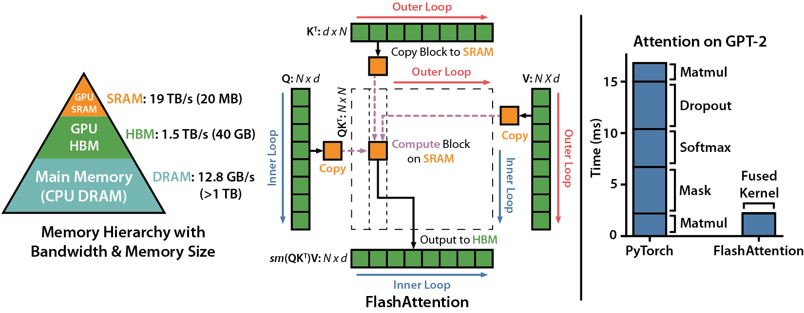
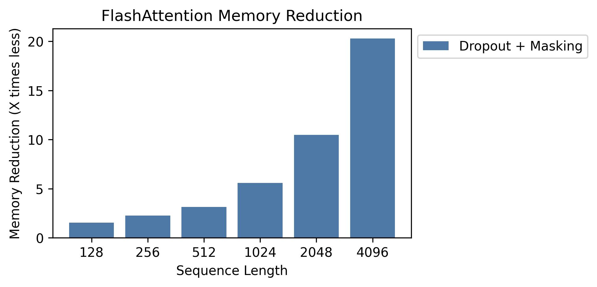
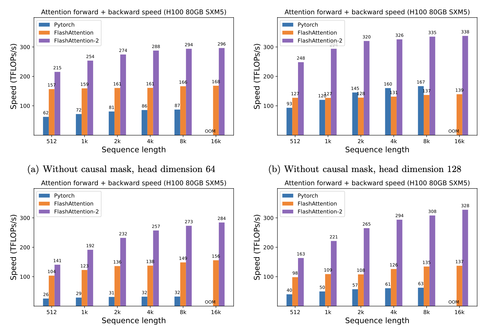

# FlashAttention
本仓库提供了以下论文中FlashAttention和FlashAttention-2的官方实现。

**FlashAttention: 快速且内存高效的精确注意力机制，具有IO感知**  
Tri Dao, Daniel Y. Fu, Stefano Ermon, Atri Rudra, Christopher Ré  
论文: https://arxiv.org/abs/2205.14135  
IEEE Spectrum [文章](https://spectrum.ieee.org/mlperf-rankings-2022) 关于我们使用FlashAttention提交到MLPerf 2.0基准测试的内容。


**FlashAttention-2: 更快的注意力机制，具有更好的并行性和工作分区**  
Tri Dao

论文: https://tridao.me/publications/flash2/flash2.pdf


## 使用方法

我们非常高兴看到FlashAttention在发布后如此短的时间内被广泛采用。这个[页面](https://github.com/Dao-AILab/flash-attention/blob/main/usage.md)包含了一个部分列表，列出了使用FlashAttention的地方。

FlashAttention和FlashAttention-2可以免费使用和修改（参见LICENSE）。如果你使用它，请引用并注明FlashAttention。


## FlashAttention-3 beta版本发布
FlashAttention-3针对Hopper GPU（例如H100）进行了优化。

博客文章: https://tridao.me/blog/2024/flash3/

论文: https://tridao.me/publications/flash3/flash3.pdf


这是一个beta版本，用于在我们将其整合到仓库的其他部分之前进行测试/基准测试。

目前发布的功能:
- FP16前向和后向

接下来几天/下周即将发布的功能:
- BF16
- 可变长度（FP16, BF16）
- FP8前向

要求: H100 / H800 GPU, CUDA >= 12.3.

安装方法:


## 安装和功能
**要求:**
- CUDA 工具包或 ROCm 工具包
- PyTorch 1.12 及以上版本。
- `packaging` Python 包 (`pip install packaging`)
- `ninja` Python 包 (`pip install ninja`) *
- Linux。从 v2.3.2 开始可能支持 Windows（我们看到了一些积极的[报告](https://github.com/Dao-AILab/flash-attention/issues/595)），但 Windows 编译仍需要更多测试。如果你有关于如何为 Windows 设置预构建 CUDA 轮子的想法，请通过 Github 问题联系我们。

\* 确保 `ninja` 已安装并且工作正常（例如 `ninja --version` 然后 `echo $?` 应返回退出代码 0）。如果没有（有时 `ninja --version` 然后 `echo $?` 返回非零退出代码），卸载然后重新安装 `ninja`（`pip uninstall -y ninja && pip install ninja`）。没有 `ninja`，编译可能需要很长时间（2小时），因为它不使用多个 CPU 核心。使用 `ninja` 在 64 核机器上使用 CUDA 工具包编译需要 3-5 分钟。

**安装方法:**


## 如何使用 FlashAttention

主要函数实现了缩放点积注意力（softmax(Q @ K^T * softmax_scale) @ V）：
```python
from flash_attn import flash_attn_qkvpacked_func, flash_attn_func
```

```python
flash_attn_qkvpacked_func(qkv, dropout_p=0.0, softmax_scale=None, causal=False,
                          window_size=(-1, -1), alibi_slopes=None, deterministic=False):
"""在评估期间，dropout_p应设置为0.0
如果Q、K、V已经堆叠成一个张量，此函数将比调用flash_attn_func更快，因为反向传播避免了Q、K、V梯度的显式concat。
如果window_size != (-1, -1)，则实现滑动窗口局部注意力。位置i的查询将仅关注[i - window_size[0], i + window_size[1]]范围内的key。
参数:
    qkv: (batch_size, seqlen, 3, nheads, headdim)
    dropout_p: float. Dropout概率。
    softmax_scale: float. 在应用softmax之前对QK^T的缩放。
        默认为1 / sqrt(headdim)。
    causal: bool. 是否应用因果注意力掩码（例如，用于自回归建模）。
    window_size: (left, right). 如果不为(-1, -1)，则实现滑动窗口局部注意力。
    alibi_slopes: (nheads,) 或 (batch_size, nheads), fp32. 对查询i和键j的注意力分数添加(-alibi_slope * |i - j|)的偏置。
    deterministic: bool. 是否使用确定性的反向传播实现，该实现稍慢且使用更多内存。前向传播始终是确定性的。
返回:
    out: (batch_size, seqlen, nheads, headdim).
"""
```

```python
flash_attn_func(q, k, v, dropout_p=0.0, softmax_scale=None, causal=False,
                window_size=(-1, -1), alibi_slopes=None, deterministic=False):
"""在评估期间，dropout_p应设置为0.0
支持多查询和分组查询注意力（MQA/GQA），通过传入比Q头部更少的KV。注意，Q中的头部数量必须能被KV中的头部数量整除。
例如，如果Q有6个头部，K和V有2个头部，Q的头部0、1、2将关注K和V的头部0，Q的头部3、4、5将关注K和V的头部1。
如果window_size != (-1, -1)，则实现滑动窗口局部注意力。位置i的查询将仅关注
[i + seqlen_k - seqlen_q - window_size[0], i + seqlen_k - seqlen_q + window_size[1]]范围内的键。

参数:
    q: (batch_size, seqlen, nheads, headdim)
    k: (batch_size, seqlen, nheads_k, headdim)
    v: (batch_size, seqlen, nheads_k, headdim)
    dropout_p: float. Dropout概率。
    softmax_scale: float. 在应用softmax之前对QK^T的缩放。
        默认为1 / sqrt(headdim)。
    causal: bool. 是否应用因果注意力掩码（例如，用于自回归建模）。
    window_size: (left, right). 如果不为(-1, -1)，则实现滑动窗口局部注意力。
    alibi_slopes: (nheads,) 或 (batch_size, nheads), fp32. 对查询i和键j的注意力分数添加(-alibi_slope * |i + seqlen_k - seqlen_q - j|)的偏置。
    deterministic: bool. 是否使用确定性的反向传播实现，该实现稍慢且使用更多内存。前向传播始终是确定性的。
返回:
    out: (batch_size, seqlen, nheads, headdim).
"""
```

```python
def flash_attn_with_kvcache(
    q,
    k_cache,
    v_cache,
    k=None,
    v=None,
    rotary_cos=None,
    rotary_sin=None,
    cache_seqlens: Optional[Union[(int, torch.Tensor)]] = None,
    cache_batch_idx: Optional[torch.Tensor] = None,
    block_table: Optional[torch.Tensor] = None,
    softmax_scale=None,
    causal=False,
    window_size=(-1, -1),  # -1 means infinite context window
    rotary_interleaved=True,
    alibi_slopes=None,
):
    """
    如果 k 和 v 不是 None，k_cache 和 v_cache 将使用 k 和 v 中的新值进行原地更新。这对于增量解码非常有用：你可以传入前一步缓存的键/值，并用当前步骤的新键/值更新它们，然后在一次内核中使用更新后的缓存进行注意力计算。

    如果你传入 k / v，你必须确保缓存足够大以容纳新值。例如，KV Cache可以预先分配最大序列长度，你可以使用 cache_seqlens 来跟踪批次中每个序列的当前序列长度。

    如果传入了 rotary_cos 和 rotary_sin，则应用旋转嵌入。键 @k 将在索引 cache_seqlens、cache_seqlens + 1 等处通过 rotary_cos 和 rotary_sin 进行旋转。如果因果或局部（即 window_size != (-1, -1)），查询 @q 将在索引 cache_seqlens、cache_seqlens + 1 等处通过 rotary_cos 和 rotary_sin 进行旋转。如果不是因果且不是局部，查询 @q 将仅在索引 cache_seqlens 处通过 rotary_cos 和 rotary_sin 进行旋转（即我们认为 @q 中的所有tokens都在位置 cache_seqlens）。

    请参阅 tests/test_flash_attn.py::test_flash_attn_kvcache 以查看如何使用此函数的示例。

    通过传入比 Q 头部更少的 KV 头部，支持多查询和分组查询注意力（MQA/GQA）。请注意，Q 中的头部数量必须能被 KV 中的头部数量整除。例如，如果 Q 有 6 个头部，K 和 V 有 2 个头部，Q 的头部 0、1、2 将关注 K 和 V 的头部 0，Q 的头部 3、4、5 将关注 K 和 V 的头部 1。

    如果 causal=True，因果掩码将与注意力矩阵的右下角对齐。例如，如果 seqlen_q = 2 且 seqlen_k = 5，因果掩码（1 = 保留，0 = 掩码）为：
        1 1 1 1 0
        1 1 1 1 1
    如果 seqlen_q = 5 且 seqlen_k = 2，因果掩码为：
        0 0
        0 0
        0 0
        1 0
        1 1
    如果掩码的某一行全为零，输出将为零。

    如果 window_size != (-1, -1)，则实现滑动窗口局部注意力。位置 i 处的查询将仅关注键在
    [i + seqlen_k - seqlen_q - window_size[0], i + seqlen_k - seqlen_q + window_size[1]] 范围内的键。

    注意：不支持反向传播。

    参数:
        q: (batch_size, seqlen, nheads, headdim)
        k_cache: 如果没有 block_table，则为 (batch_size_cache, seqlen_cache, nheads_k, headdim)；如果有 block_table（即分页 KV Cache），则为 (num_blocks, page_block_size, nheads_k, headdim)
            page_block_size 必须是 256 的倍数。
        v_cache: 如果没有 block_table，则为 (batch_size_cache, seqlen_cache, nheads_k, headdim)；如果有 block_table（即分页 KV Cache），则为 (num_blocks, page_block_size, nheads_k, headdim)
        k [可选]: (batch_size, seqlen_new, nheads_k, headdim)。如果不是 None，我们将 k 与 k_cache 连接，从 cache_seqlens 指定的索引开始。
        v [可选]: (batch_size, seqlen_new, nheads_k, headdim)。类似于 k。
        rotary_cos [可选]: (seqlen_ro, rotary_dim / 2)。如果不是 None，我们将旋转嵌入应用于 k 和 q。仅在传入 k 和 v 时适用。rotary_dim 必须能被 16 整除。
        rotary_sin [可选]: (seqlen_ro, rotary_dim / 2)。类似于 rotary_cos。
        cache_seqlens: int，或 (batch_size,)，dtype torch.int32。KV Cache的序列长度。
        block_table [可选]: (batch_size, max_num_blocks_per_seq)，dtype torch.int32。
        cache_batch_idx: (batch_size,)，dtype torch.int32。用于索引 KV Cache的索引。如果为 None，我们假设批次索引为 [0, 1, 2, ..., batch_size - 1]。
            如果索引不唯一，并且提供了 k 和 v，缓存中更新的值可能来自任何重复索引。
        softmax_scale: float。在应用 softmax 之前对 QK^T 的缩放。
            默认为 1 / sqrt(headdim)。
        causal: bool。是否应用因果注意力掩码（例如，用于自回归建模）。
        window_size: (left, right)。如果不为 (-1, -1)，则实现滑动窗口局部注意力。
        rotary_interleaved: bool。仅在传入 rotary_cos 和 rotary_sin 时适用。
            如果为 True，旋转嵌入将组合维度 0 & 1, 2 & 3 等。如果为 False，旋转嵌入将组合维度 0 & rotary_dim / 2, 1 & rotary_dim / 2 + 1（即 GPT-NeoX 风格）。
        alibi_slopes: (nheads,) 或 (batch_size, nheads)，fp32。对查询 i 和键 j 的注意力分数添加 (-alibi_slope * |i + seqlen_k - seqlen_q - j|) 的偏置。

    返回:
        out: (batch_size, seqlen, nheads, headdim)。
    """
```

要查看这些函数如何在多头注意力层中使用（包括QKV投影和输出投影），请参见MHA [实现](https://github.com/Dao-AILab/flash-attention/blob/main/flash_attn/modules/mha.py)。

## 更新日志

### 2.0: 完全重写，速度提升2倍
从FlashAttention (1.x) 升级到 FlashAttention-2

这些函数已被重命名：
- `flash_attn_unpadded_func` -> `flash_attn_varlen_func`
- `flash_attn_unpadded_qkvpacked_func` -> `flash_attn_varlen_qkvpacked_func`
- `flash_attn_unpadded_kvpacked_func` -> `flash_attn_varlen_kvpacked_func`

如果输入在同一批次中具有相同的序列长度，使用这些函数会更简单和更快：

```python
flash_attn_qkvpacked_func(qkv, dropout_p=0.0, softmax_scale=None, causal=False)
```

```python
flash_attn_func(q, k, v, dropout_p=0.0, softmax_scale=None, causal=False)
```


### 2.1: 更改因果标志的行为

如果 seqlen_q != seqlen_k 且 causal=True，因果掩码将对齐到注意力矩阵的右下角，而不是左上角。

例如，如果 seqlen_q = 2 且 seqlen_k = 5，因果掩码（1 = 保留，0 = 掩码）为：  
v2.0:  
    1 0 0 0 0  
    1 1 0 0 0  
v2.1:  
    1 1 1 1 0  
    1 1 1 1 1  

如果 seqlen_q = 5 且 seqlen_k = 2，因果掩码为：  
v2.0:  
    1 0  
    1 1  
    1 1  
    1 1  
    1 1  
v2.1:  
    0 0  
    0 0  
    0 0  
    1 0  
    1 1  
如果掩码的某一行全为零，输出将为零。

### 2.2: 优化推理

优化推理（迭代解码）当查询序列长度非常小（例如，查询序列长度 = 1）时。这里的瓶颈是尽可能快地加载KV缓存，我们将加载分散到不同的线程块中，并使用单独的内核来合并结果。

查看函数 `flash_attn_with_kvcache`，了解更多推理功能（执行旋转嵌入，就地更新KV缓存）。

感谢xformers团队，特别是Daniel Haziza，为此合作做出的贡献。

### 2.3: 局部（即滑动窗口）注意力

实现滑动窗口注意力（即局部注意力）。感谢[Mistral AI](https://mistral.ai/)，特别是Timothée Lacroix的贡献。滑动窗口被用于[Mistral 7B](https://mistral.ai/news/announcing-mistral-7b/)模型。

### 2.4: ALiBi（带线性偏置的注意力），确定性反向传播

实现ALiBi（Press et al., 2021）。感谢Kakao Brain的Sanghun Cho的贡献。

实现确定性反向传播。感谢[美团](www.meituan.com)的工程师们的贡献。

### 2.5: 分页KV缓存

支持分页KV缓存（即[PagedAttention](https://arxiv.org/abs/2309.06180)）。感谢@beginlner的贡献。

### 2.6: 软上限

支持带软上限的注意力，如在Gemma-2和Grok模型中使用。感谢@Narsil和@lucidrains的贡献。

## 性能

我们展示了使用FlashAttention相对于PyTorch标准注意力的预期加速（前向+后向pass的组合）和内存节省，具体取决于不同GPU上的序列长度（加速取决于内存带宽——我们在较慢的GPU内存上看到更多的加速）。

我们目前有这些GPU的基准测试：
* [A100](#a100)
* [H100](#h100)
<!-- * [RTX 3090](#rtx-3090) -->
<!-- * [T4](#t4) -->

### A100

我们使用以下参数展示FlashAttention的加速：
* 头维度64或128，隐藏维度2048（即32或16个头）。
* 序列长度512, 1k, 2k, 4k, 8k, 16k。
* 批量大小设置为16k / 序列长度。

#### 加速


#### 内存



我们在这个图中展示了内存节省（注意，无论是否使用dropout或掩码，内存占用都是相同的）。
内存节省与序列长度成正比——因为标准注意力在序列长度上具有二次内存，而FlashAttention在序列长度上具有线性内存。
我们在序列长度2K时看到10倍的内存节省，在4K时看到20倍的内存节省。
因此，FlashAttention可以扩展到更长的序列长度。

### H100



## 完整模型代码和训练脚本

我们已发布完整的GPT模型
[实现](https://github.com/Dao-AILab/flash-attention/blob/main/flash_attn/models/gpt.py)。
我们还提供了其他层的优化实现（例如，MLP、LayerNorm、
交叉熵损失、旋转嵌入）。总体上，这比Huggingface的基线实现快3-5倍，
每A100达到高达225 TFLOPs/秒，相当于72%的模型FLOPs利用率（我们不需要
任何激活检查点）。

我们还包含一个训练
[脚本](https://github.com/Dao-AILab/flash-attention/tree/main/training)，
用于在Openwebtext上训练GPT2和在The Pile上训练GPT3。

## FlashAttention的Triton实现

Phil Tillet (OpenAI) 在Triton中有一个实验性的FlashAttention实现：
https://github.com/openai/triton/blob/master/python/tutorials/06-fused-attention.py

由于Triton比CUDA更高级，可能更容易理解和实验。
Triton实现中的符号也更接近我们论文中使用的符号。

我们还有一个支持注意力偏置（例如ALiBi）的实验性Triton实现：
https://github.com/Dao-AILab/flash-attention/blob/main/flash_attn/flash_attn_triton.py


## 测试
我们测试FlashAttention产生的输出和梯度与参考实现相同，
直到一定的数值容差。特别是，我们检查FlashAttention的最大数值误差
最多是Pytorch中基线实现数值误差的两倍（对于不同的头维度、输入
数据类型、序列长度、因果/非因果）。

运行测试：

```python
pytest -q -s tests/test_flash_attn.py
```

## 遇到问题时

这个新版本的FlashAttention-2已经在多个GPT风格的模型上进行了测试，主要是在A100 GPU上。

如果你遇到错误，请在GitHub上提交一个Issue！

## 测试

运行测试：

```python
pytest tests/test_flash_attn_ck.py
```

## 引用

如果你使用这个代码库，或者认为我们的工作有价值，请引用：

```
@inproceedings{dao2022flashattention,
  title={Flash{A}ttention: Fast and Memory-Efficient Exact Attention with {IO}-Awareness},
  author={Dao, Tri and Fu, Daniel Y. and Ermon, Stefano and Rudra, Atri and R{\'e}, Christopher},
  booktitle={Advances in Neural Information Processing Systems (NeurIPS)},
  year={2022}
}
@inproceedings{dao2023flashattention2,
  title={Flash{A}ttention-2: Faster Attention with Better Parallelism and Work Partitioning},
  author={Dao, Tri},
  booktitle={International Conference on Learning Representations (ICLR)},
  year={2024}
}
```
